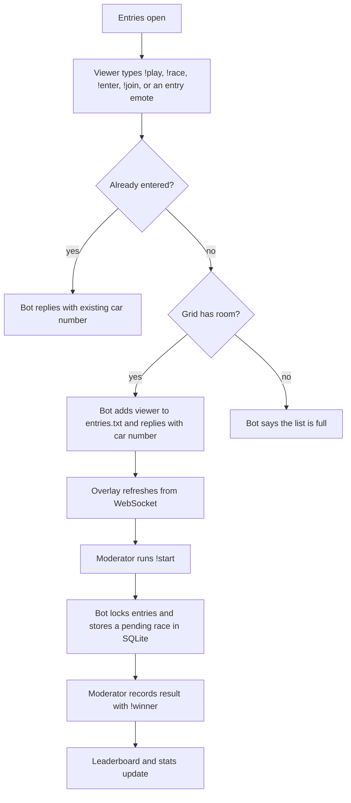
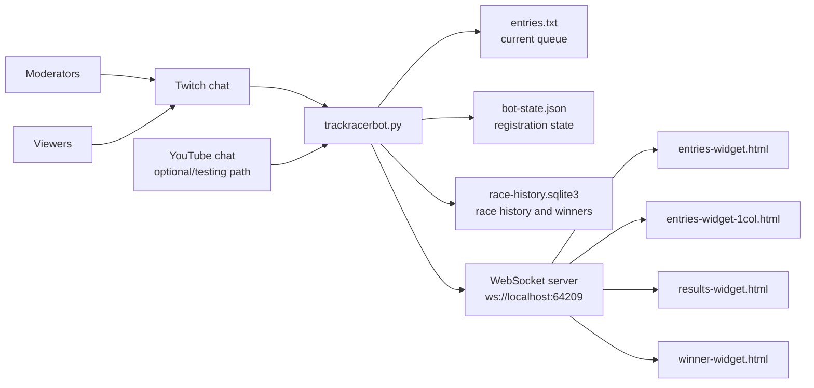
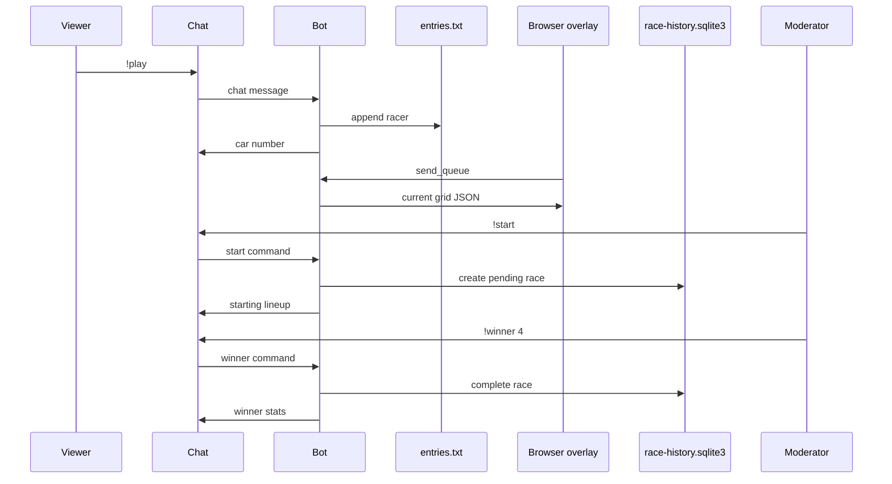

# Track Racer Bot

A chat-controlled race entry bot for 2Beer Minimum Racing.

Viewers enter races from chat. Moderators lock the grid, clear it, reopen it, and record winners. Browser overlays read live data from the bot over a local WebSocket server.

## Viewer Commands

| Command | What it does |
| --- | --- |
| `!play` | Enter the next race. |
| `!race` | Enter the next race. Same behavior as `!play`. |
| `!enter` | Enter the next race. Same behavior as `!play`. |
| `!join` | Enter the next race. Same behavior as `!play`. |
| `!entries` | Show the current race entry list. |
| `!entry` | Show your current grid position. |
| `!entry <number>` | Look up the racer assigned to a car number in the current grid. |
| `!entry <name>` | Look up another racer in the current grid. |
| `!winner` | Show the latest recorded race result. |
| `!leaderboard` | Show the top winners. |
| `!stats` | Show your race stats. |
| `!stats <number>` | Show stats for the racer assigned to a car number in the latest race. |
| `!stats <name>` | Show another racer's stats. |
| `!carstats <number>` | Show win stats for a car number across recorded races. |
| `!carleaderboard` | Show the top winning car numbers. |
| `!commands` | Print the public command list. |

Some channel emotes also enter a viewer when they appear at the start of a chat message. The current list is maintained in `trackracerbot.py`.

## Moderator Commands

| Command | What it does |
| --- | --- |
| `!start` | Lock entries, start the race, and announce the current lineup. |
| `!openentries` | Open registration without clearing the current queue. |
| `!closeentries` | Close registration without clearing the current queue. |
| `!clearentries` | Clear the queue and reopen registration. |
| `!winner <number>` | Record the winner for the latest pending race by car number. |
| `!winner <name>` | Record the winner for the latest pending race by racer name. |
| `!setlastwinner <number>` | Correct the latest race result by car number. |
| `!setlastwinner <name>` | Correct the latest race result by racer name. |
| `!setlastwinner skipped` | Mark the latest race as skipped. |
| `!setlastwinner unknown` | Mark the latest race winner as unknown. |

Moderator commands only work for Twitch users marked as moderators by the chat message metadata.

## Race Flow



## System View





## Running Locally

Use a virtual environment. The known-good local environment for this workspace is `.venv-codex`.

```powershell
. .\.venv-codex\Scripts\Activate.ps1
python trackracerbot.py
```

If you need to rebuild dependencies:

```powershell
python -m pip install -r requirements.txt
```

The bot reads credentials and runtime settings from `.env`. Start from `.env.default` and keep real tokens local.

Required Twitch settings:

| Variable | Purpose |
| --- | --- |
| `TWITCH_CLIENT_ID` | Twitch application client ID. |
| `TWITCH_CLIENT_SECRET` | Twitch application secret. |
| `TWITCH_ACCESS_TOKEN` | Bot OAuth access token. |
| `TWITCH_REFRESH_TOKEN` | Bot OAuth refresh token. |
| `TWITCH_CHANNEL` | Channel to join. |
| `TWITCH_BOT_NAME` | Bot account name. |

Optional settings:

| Variable | Purpose |
| --- | --- |
| `ENTRY_FILE` | Entry queue file. Defaults to `entries.txt`. |
| `BOT_STATE_FILE` | Registration state file. Defaults to `bot-state.json` near the entry file. |
| `RACE_HISTORY_DB` | SQLite history file. Defaults to `race-history.sqlite3` near the entry file. |
| `CHAT_CAPTURE_FILE` | Optional JSONL capture file for chat fixtures/debugging. |
| `YOUTUBE_API_KEY` | YouTube Data API key for the YouTube integration path. |
| `YOUTUBE_LIVE_VIDEO_ID` | YouTube live stream video ID for the YouTube integration path. |

## Browser Overlays

Committed widget HTML defaults to:

```text
ws://localhost:64209
```

Use the local files directly as browser sources when the bot and OBS/browser are on the same machine. For deployment-specific copies, generate ignored files under `widget-exports/` instead of editing committed widget source:

```powershell
python scripts\update_widget_ip.py --help
```

## Files That Matter

| File | Purpose |
| --- | --- |
| `trackracerbot.py` | Main Twitch bot, command handling, WebSocket server, queue state. |
| `race_history.py` | SQLite race history, winners, stats, leaderboard. |
| `entries-widget.html` | Main entries overlay. |
| `entries-widget-1col.html` | Single-column entries overlay. |
| `results-widget.html` | Results overlay. |
| `winner-widget.html` | Winner overlay. |
| `entries.txt` | Runtime queue state. Ignored by git. |
| `bot-state.json` | Runtime registration state. |
| `race-history.sqlite3` | Runtime race history database. |
| `BOT_DOCUMENTATION.md` | More detailed technical notes. |

## Verification

Run the Python tests:

```powershell
pytest
```

Run the widget paging test:

```powershell
node tests/entries_widget_paging.test.js
```

Before committing or pushing, scan tracked files for IPv4-shaped literals and inspect every result:

```powershell
git grep -n -E "\b([0-9]{1,3}\.){3}[0-9]{1,3}\b"
```

`0.0.0.0` is acceptable as a documented server bind address. `browsersource.js` is legacy tracked content and can be left alone unless it is part of the change.
